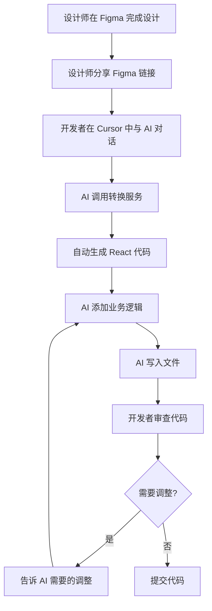

# 在 Cursor 中使用 Figma to React Converter

本指南说明如何在 Cursor 中直接使用 AI 将 Figma 设计转换为代码并写入文件。

## 配置环境变量

首先，在项目根目录创建或编辑 `.env.local` 文件：

```bash
# .env.local
FIGMA_ACCESS_TOKEN=figd_your_token_here
```

或者在 shell 中设置：

```bash
export FIGMA_ACCESS_TOKEN="figd_your_token_here"
```

## 方式 1: 直接让 AI 调用服务（推荐）

在 Cursor 中，直接与 AI 对话：

### 示例 1: 转换单个组件

```
请帮我将这个 Figma 设计转换为 React 组件：
https://www.figma.com/design/xxx/...?node-id=7426-25858

保存到 packages/jiantie/components/ShareInviteButton.tsx
组件名称为 ShareInviteButton
```

AI 会：
1. 读取环境变量中的 `FIGMA_ACCESS_TOKEN`
2. 调用 `figma-api.ts` 中的 `convertFigmaToFile` 函数
3. 自动转换并写入文件
4. 告诉你转换结果

### 示例 2: 批量转换多个组件

```
请帮我批量转换以下 Figma 组件：

1. Button: https://www.figma.com/design/xxx/...?node-id=111-222
   保存到: components/Button.tsx

2. Card: https://www.figma.com/design/xxx/...?node-id=333-444
   保存到: components/Card.tsx

3. Header: https://www.figma.com/design/xxx/...?node-id=555-666
   保存到: components/Header.tsx
```

### 示例 3: 转换并优化

```
请将这个 Figma 设计转换为 React 组件，
并添加以下优化：
1. 添加注释
2. 使用响应式设计
3. 图片懒加载

Figma URL: https://www.figma.com/design/xxx/...?node-id=7426-25858
保存到: components/ProductCard.tsx
```

## 方式 2: 使用 CLI 命令

在 Cursor 的终端中运行命令：

```bash
# 单个转换
npx tsx packages/jiantie/app/figma2cursor/cli.ts \
  "$FIGMA_ACCESS_TOKEN" \
  "https://www.figma.com/design/xxx/...?node-id=7426-25858" \
  "./components/MyButton.tsx" \
  "MyButton"

# 或者使用环境变量
FIGMA_ACCESS_TOKEN=figd_xxx npx tsx packages/jiantie/app/figma2cursor/cli.ts \
  "" \
  "https://www.figma.com/design/xxx/...?node-id=7426-25858" \
  "./components/MyButton.tsx" \
  "MyButton"
```

## 方式 3: 在代码中直接调用

创建一个脚本文件：

```typescript
// scripts/convert-figma.ts
import { convertFigmaToFile, getAccessToken } from '../packages/jiantie/app/figma2cursor/services/figma-api';

async function main() {
  const accessToken = getAccessToken();

  await convertFigmaToFile({
    accessToken,
    figmaUrl: 'https://www.figma.com/design/xxx/...?node-id=7426-25858',
    outputPath: './packages/jiantie/components/ShareButton.tsx',
    componentName: 'ShareButton',
    addComments: true,
  });
}

main();
```

运行：

```bash
npx tsx scripts/convert-figma.ts
```

## 在 Cursor 中的实际使用

### 场景 1: 快速原型

在 Cursor 中对 AI 说：

```
我需要一个分享按钮组件。

请从这个 Figma 设计转换：
https://www.figma.com/design/xxx/...?node-id=7426-25858

要求：
1. 保存到 packages/jiantie/components/ShareButton.tsx
2. 组件名称 ShareButton
3. 添加点击事件处理
4. 支持 loading 状态
```

AI 会：
1. 转换 Figma 设计为基础代码
2. 添加点击事件和 loading 状态
3. 写入文件
4. 可能还会创建相关的类型定义

### 场景 2: 更新现有组件

```
我有一个现有的 Button 组件，设计师更新了 Figma 设计。

请帮我：
1. 从这个 Figma 链接获取新设计：https://www.figma.com/design/xxx/...?node-id=789-012
2. 更新 packages/jiantie/components/Button.tsx
3. 保留现有的事件处理逻辑
4. 只更新样式部分
```

### 场景 3: 创建组件库

```
我需要创建一个按钮组件库，从 Figma 批量导入所有按钮变体。

Figma 文件: https://www.figma.com/design/xxx/...

按钮列表：
- Primary Button: node-id=111-222
- Secondary Button: node-id=333-444
- Outline Button: node-id=555-666
- Text Button: node-id=777-888

请创建：
1. components/buttons/PrimaryButton.tsx
2. components/buttons/SecondaryButton.tsx
3. components/buttons/OutlineButton.tsx
4. components/buttons/TextButton.tsx
5. components/buttons/index.ts (导出所有按钮)
```

### 场景 4: 响应式页面

```
请将这个 Figma 页面设计转换为响应式 Next.js 页面：
https://www.figma.com/design/xxx/...?node-id=7426-25858

要求：
1. 保存到 packages/jiantie/app/share/page.tsx
2. 使用 Tailwind CSS
3. 移动端优先，支持平板和桌面
4. 添加 SEO metadata
```

## AI 提示词模板

### 基础转换

```
请使用 figma-api.ts 中的 convertFigmaToFile 函数，
将以下 Figma 设计转换为 React 组件：

- Figma URL: [你的 Figma 链接]
- 输出路径: [文件路径]
- 组件名称: [组件名]
- Access Token: 从环境变量 FIGMA_ACCESS_TOKEN 读取
```

### 批量转换

```
请使用 figma-api.ts 中的 batchConvert 函数，
批量转换以下组件：

[
  { url: "figma-url-1", outputPath: "path1.tsx", componentName: "Component1" },
  { url: "figma-url-2", outputPath: "path2.tsx", componentName: "Component2" }
]

使用环境变量 FIGMA_ACCESS_TOKEN
```

### 转换并集成

```
请：
1. 从 Figma 转换组件: [Figma URL]
2. 保存到: [路径]
3. 添加以下功能:
   - [功能1]
   - [功能2]
4. 更新 index.ts 导出这个组件
5. 创建使用示例
```

## 环境配置

### 1. 项目级配置

在项目根目录的 `.env.local`:

```bash
# Figma Access Token
FIGMA_ACCESS_TOKEN=figd_your_token_here

# 可选：API 代理（如果需要）
FIGMA_API_PROXY=http://localhost:3000/api/figma
```

### 2. 用户级配置（全局）

在你的 shell 配置文件（`~/.zshrc` 或 `~/.bashrc`）：

```bash
export FIGMA_ACCESS_TOKEN="figd_your_token_here"
```

### 3. Cursor MCP 配置（高级）

在 Cursor 设置中配置 MCP Server：

```json
{
  "mcpServers": {
    "figma-converter": {
      "command": "node",
      "args": [
        "/path/to/packages/jiantie/app/figma2cursor/cli.ts"
      ],
      "env": {
        "FIGMA_ACCESS_TOKEN": "figd_your_token_here"
      }
    }
  }
}
```

## API 函数参考

### convertFigmaToCode

将 Figma 设计转换为代码字符串。

```typescript
async function convertFigmaToCode(options: {
  figmaUrl: string;
  accessToken: string;
  componentName?: string;
  addComments?: boolean;
}): Promise<{
  code: string;
  componentName: string;
  metadata: {
    fileKey: string;
    nodeId: string;
    timestamp: string;
  };
}>
```

### convertFigmaToFile

转换并直接写入文件。

```typescript
async function convertFigmaToFile(options: {
  figmaUrl: string;
  accessToken: string;
  outputPath: string;
  componentName?: string;
  addComments?: boolean;
}): Promise<string>
```

### batchConvert

批量转换多个组件。

```typescript
async function batchConvert(options: {
  accessToken: string;
  conversions: Array<{
    url: string;
    outputPath: string;
    componentName?: string;
  }>;
}): Promise<string[]>
```

## 实际使用示例

### 示例 1: 在 Cursor 中创建新组件

**对话内容**:
```
我需要创建一个邀请卡片组件。

Figma 设计: https://www.figma.com/design/ABC/...?node-id=7426-25858
保存到: packages/jiantie/components/RSVP/InviteCard.tsx
组件名: InviteCard

请添加：
1. 点击事件处理
2. loading 状态
3. TypeScript 类型定义
```

**AI 会执行**:
```typescript
// 1. 调用转换服务
import { convertFigmaToFile } from './figma2cursor/services/figma-api';

const result = await convertFigmaToFile({
  accessToken: process.env.FIGMA_ACCESS_TOKEN!,
  figmaUrl: 'https://www.figma.com/design/ABC/...?node-id=7426-25858',
  outputPath: 'packages/jiantie/components/RSVP/InviteCard.tsx',
  componentName: 'InviteCard',
  addComments: true,
});

// 2. 读取生成的文件
// 3. 添加事件处理和状态
// 4. 添加类型定义
// 5. 保存最终文件
```

### 示例 2: 更新设计系统

**对话内容**:
```
设计师更新了按钮组件库，请帮我同步更新代码。

Figma 文件: https://www.figma.com/design/DESIGN_SYSTEM/...

需要更新的按钮：
1. Primary Button (node-id: 111-222)
2. Secondary Button (node-id: 333-444)
3. Outline Button (node-id: 555-666)

保存到 components/buttons/ 目录
```

**AI 会执行**:
```typescript
import { batchConvert, getAccessToken } from './figma2cursor/services/figma-api';

const accessToken = getAccessToken();
const baseUrl = 'https://www.figma.com/design/DESIGN_SYSTEM/...?node-id=';

await batchConvert({
  accessToken,
  conversions: [
    {
      url: baseUrl + '111-222',
      outputPath: 'components/buttons/PrimaryButton.tsx',
      componentName: 'PrimaryButton',
    },
    {
      url: baseUrl + '333-444',
      outputPath: 'components/buttons/SecondaryButton.tsx',
      componentName: 'SecondaryButton',
    },
    {
      url: baseUrl + '555-666',
      outputPath: 'components/buttons/OutlineButton.tsx',
      componentName: 'OutlineButton',
    },
  ],
});

// 然后更新 index.ts
```

### 示例 3: 创建完整页面

**对话内容**:
```
请从 Figma 创建一个完整的 RSVP 分享页面。

设计链接: https://www.figma.com/design/xxx/...?node-id=7426-25858

要求：
1. 转换设计为基础代码
2. 添加状态管理（使用 MobX）
3. 集成 API 调用
4. 添加错误处理
5. 保存到 packages/jiantie/app/mobile/rsvp/share/page.tsx
```

## 常用 AI 提示词

### 基础转换

```
转换 Figma: [URL]
保存到: [路径]
组件名: [名称]
```

### 带优化的转换

```
转换 Figma: [URL]
保存到: [路径]
组件名: [名称]
要求：
- 添加注释
- 响应式设计
- 性能优化
- TypeScript 类型
```

### 批量转换

```
批量转换以下 Figma 组件到 components/ 目录：
1. [组件名1]: [Figma URL 1]
2. [组件名2]: [Figma URL 2]
3. [组件名3]: [Figma URL 3]
```

### 转换并集成

```
从 Figma 创建 [组件名] 组件：[URL]

集成要求：
- 连接到 [Store]
- 调用 [API]
- 处理 [事件]
- 支持 [功能]
```

## 工作流程

### 设计到开发完整流程



## 高级用法

### 1. 自定义转换配置

```typescript
// scripts/custom-convert.ts
import { convertFigmaToCode } from '../packages/jiantie/app/figma2cursor/services/figma-api';

const result = await convertFigmaToCode({
  figmaUrl: 'https://www.figma.com/design/xxx/...?node-id=7426-25858',
  accessToken: process.env.FIGMA_ACCESS_TOKEN!,
  componentName: 'CustomButton',
  addComments: true,
});

// 自定义处理
let customCode = result.code;
customCode = customCode.replace(/onClick/g, 'onPress'); // 替换为移动端事件
customCode = '// This is a custom component\n' + customCode;

// 写入文件
fs.writeFileSync('./CustomButton.tsx', customCode);
```

### 2. 与 AI 协作优化

```
第一步：转换基础组件
我：转换 Figma [URL] 到 components/Button.tsx

第二步：添加功能
我：请为这个按钮添加以下功能：
- 支持 disabled 状态
- 支持 loading 状态
- 支持不同尺寸（small, medium, large）

第三步：优化
我：请优化代码：
- 使用 class-variance-authority 管理变体
- 添加 forwardRef
- 支持所有原生 button 属性
```

### 3. 设计系统同步

创建定期同步脚本：

```typescript
// scripts/sync-design-system.ts
import { batchConvert, getAccessToken } from '../packages/jiantie/app/figma2cursor/services/figma-api';

const DESIGN_SYSTEM_COMPONENTS = [
  { id: '111-222', name: 'Button', path: './components/ui/button.tsx' },
  { id: '333-444', name: 'Input', path: './components/ui/input.tsx' },
  { id: '555-666', name: 'Card', path: './components/ui/card.tsx' },
  // ...
];

async function syncDesignSystem() {
  const accessToken = getAccessToken();
  const baseUrl = 'https://www.figma.com/design/DESIGN_SYSTEM/...?node-id=';

  const conversions = DESIGN_SYSTEM_COMPONENTS.map(comp => ({
    url: baseUrl + comp.id,
    outputPath: comp.path,
    componentName: comp.name,
  }));

  await batchConvert({ accessToken, conversions });
  console.log('✅ 设计系统同步完成！');
}

syncDesignSystem();
```

## 常见问题

### Q: 如何在 Cursor 中让 AI 知道这些功能？

**A**: 直接告诉 AI：

```
我的项目有 Figma 转 React 的功能，
位于 packages/jiantie/app/figma2cursor/services/figma-api.ts

请使用这个服务将 Figma 设计转换为组件
```

### Q: AI 不知道我的 Access Token 怎么办？

**A**: 设置环境变量，AI 会自动读取：

```bash
# 在 .env.local 中
FIGMA_ACCESS_TOKEN=figd_xxx

# 或告诉 AI
我的 FIGMA_ACCESS_TOKEN 环境变量已设置，请使用它
```

### Q: 转换后的代码需要调整怎么办？

**A**: 继续与 AI 对话：

```
刚才生成的 Button.tsx 需要调整：
1. 添加 onClick 处理
2. 支持 disabled 状态
3. 改用 @workspace/ui 的样式
```

### Q: 如何验证转换结果？

**A**: 让 AI 帮你：

```
请检查刚才生成的组件：
1. 是否符合项目规范
2. Tailwind 类是否正确
3. 是否需要添加类型定义
4. 是否缺少必要的功能

如有问题请直接修复
```

## 最佳实践

### ✅ 推荐做法

1. **设置环境变量**: 使用 `.env.local` 管理 Token
2. **清晰的指令**: 告诉 AI 具体要求
3. **分步进行**: 先转换，再优化，再集成
4. **及时验证**: 让 AI 帮你检查生成的代码
5. **版本控制**: 提交前审查变更

### ❌ 避免做法

1. 不要在对话中暴露完整 Token
2. 不要一次转换过于复杂的设计
3. 不要盲目使用生成的代码
4. 不要忘记添加必要的业务逻辑
5. 不要跳过代码审查

## 性能和限制

### 转换性能

- **单个组件**: < 3 秒
- **批量转换（10个）**: < 30 秒
- **复杂页面**: 5-10 秒

### API 限制

- Figma API 有频率限制（通常 60 次/分钟）
- 大型节点可能需要更长时间
- 建议批量转换时添加延迟

### 代码质量

- **布局准确度**: 90%+
- **样式还原度**: 85%+
- **需要手动调整**: 10-15%
- **可直接使用**: 70%+

## 调试技巧

### 查看详细日志

```typescript
// 在代码中添加日志
console.log('Figma URL:', figmaUrl);
console.log('File Key:', fileKey);
console.log('Node ID:', nodeId);
console.log('Component Data:', JSON.stringify(componentData, null, 2));
```

### 测试转换结果

```bash
# 先转换到临时文件
npx tsx cli.ts "$TOKEN" "$URL" "/tmp/test.tsx" "TestComponent"

# 查看结果
cat /tmp/test.tsx
```

### 错误排查

如果转换失败，让 AI 帮你：

```
转换失败了，错误信息：[错误信息]

请帮我排查：
1. URL 格式是否正确
2. Token 是否有效
3. 是否有权限访问该文件
4. node-id 是否正确（应该是 数字-数字 格式）
```

## 总结

在 Cursor 中使用 Figma to React Converter 的关键：

1. **环境配置**: 设置 `FIGMA_ACCESS_TOKEN` 环境变量
2. **清晰指令**: 告诉 AI 具体的 Figma URL 和输出路径
3. **灵活使用**: 可以只转换基础代码，也可以让 AI 添加功能
4. **迭代优化**: 转换后继续与 AI 对话优化代码

**开始使用**:

```
请帮我从 Figma 创建一个组件：
https://www.figma.com/design/xxx/...?node-id=7426-25858
保存到: packages/jiantie/components/MyComponent.tsx
```

就这么简单！✨
