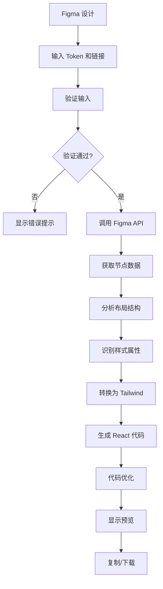

# Figma to React Converter - 项目总览

> 将 Figma 设计稿智能转换为 React + Tailwind CSS 组件

## 📚 文档索引

### 🚀 快速开始
- **[在 Cursor 中使用 (CURSOR_USAGE.md)](./CURSOR_USAGE.md)** ⭐⭐⭐ **强烈推荐**
  - 直接在 Cursor 中与 AI 对话使用
  - 自动转换并写入文件
  - 无需手动操作界面
  - 最高效的使用方式

- **[配置指南 (CONFIGURATION.md)](./CONFIGURATION.md)** ⭐ 必读
  - 环境变量配置
  - Cursor 使用配置
  - 快速验证设置

- **[快速开始指南 (QUICKSTART.md)](./QUICKSTART.md)**
  - 5 分钟快速上手
  - UI 界面使用方法
  - 实际示例演示

### 📖 使用文档
- **[使用手册 (README.md)](./README.md)**
  - 完整功能介绍
  - 详细使用步骤
  - 最佳实践建议
  - 常见问题解答

### 🔧 技术文档
- **[实现说明 (IMPLEMENTATION.md)](./IMPLEMENTATION.md)**
  - 技术架构设计
  - 核心算法实现
  - 设计决策说明
  - 测试和部署指南

- **[AI 使用指南 (AI_INSTRUCTIONS.md)](./AI_INSTRUCTIONS.md)**
  - 专为 Cursor AI 设计
  - API 调用指南
  - 错误处理模式
  - 代码增强建议

### 🚀 高级功能
- **[MCP 集成指南 (MCP_INTEGRATION.md)](./MCP_INTEGRATION.md)**
  - Cursor MCP 配置
  - AI 辅助转换
  - 高级用例演示
  - 工作流优化

## 🎯 核心功能

### ✨ 智能转换
- 自动识别 Figma Auto Layout
- 智能生成 Tailwind CSS 类
- 支持复杂嵌套结构
- 优化的代码输出

### 🎨 样式处理
- Tailwind CSS 优先
- 颜色智能映射
- 响应式设计支持
- 自定义样式回退

### 🚀 性能优化
- 图片懒加载
- 代码优化
- 类名去重
- 最小化输出

### 🛠️ 开发体验
- 实时预览
- 错误提示
- 进度反馈
- 代码下载

## 📁 项目结构

```
figma2cursor/
├── 📄 文档
│   ├── INDEX.md              # 本文件 - 项目总览
│   ├── QUICKSTART.md         # 快速开始指南
│   ├── README.md             # 使用手册
│   ├── IMPLEMENTATION.md     # 实现说明
│   └── MCP_INTEGRATION.md    # MCP 集成指南
│
├── 🎨 组件 (components/)
│   ├── FigmaImporter.tsx     # Figma 导入组件
│   │   ├── Token 输入
│   │   ├── 链接输入
│   │   ├── 转换控制
│   │   └── 进度显示
│   │
│   └── CodePreview.tsx       # 代码预览组件
│       ├── 双视图切换
│       ├── 代码高亮
│       ├── 复制功能
│       └── 下载功能
│
├── ⚙️ 服务 (services/)
│   ├── figma.ts              # Figma API 客户端
│   │   ├── getFile()
│   │   ├── getNode()
│   │   └── getImageFills()
│   │
│   ├── figma-converter.ts    # 核心转换器
│   │   ├── detectLayout()    # 布局识别
│   │   ├── convertNode()     # 节点转换
│   │   ├── generateCode()    # 代码生成
│   │   └── optimize()        # 代码优化
│   │
│   ├── code-optimizer.ts     # 代码优化器
│   │   ├── 类名优化
│   │   ├── 响应式处理
│   │   └── 性能优化
│   │
│   └── error-handler.ts      # 错误处理器
│       ├── 错误识别
│       ├── 友好提示
│       └── 解决方案
│
└── 🖥️ 页面
    └── page.tsx              # 主页面
        ├── 布局设计
        ├── 状态管理
        └── 组件编排
```

## 🔄 转换流程



## 🎓 学习路径

### 🔰 入门级（30 分钟）
1. 阅读 [快速开始指南](./QUICKSTART.md)
2. 尝试转换一个简单按钮
3. 理解基本转换流程

### 📖 进阶级（2 小时）
1. 阅读 [使用手册](./README.md)
2. 学习最佳实践
3. 转换复杂组件
4. 了解优化技巧

### 🎯 专家级（1 天）
1. 阅读 [实现说明](./IMPLEMENTATION.md)
2. 理解核心算法
3. 学习代码优化
4. 掌握调试技巧

### 🚀 大师级（持续）
1. 阅读 [MCP 集成指南](./MCP_INTEGRATION.md)
2. 配置 Cursor MCP
3. 使用 AI 辅助转换
4. 优化团队工作流

## 💡 使用场景

### 场景 1: 快速原型开发
**目标**: 快速将设计转为可交互原型

**步骤**:
1. 设计师在 Figma 完成设计
2. 开发者使用本工具转换
3. 添加交互逻辑
4. 快速验证和迭代

**收益**: 节省 60% 的初期开发时间

### 场景 2: 组件库开发
**目标**: 构建企业级组件库

**步骤**:
1. 从 Figma 组件库批量转换
2. 生成基础组件代码
3. 添加 props 和逻辑
4. 编写文档和测试

**收益**: 保持设计和代码的一致性

### 场景 3: 设计系统维护
**目标**: 同步设计系统更新

**步骤**:
1. 定期从 Figma 获取更新
2. 转换新的设计变更
3. 对比代码差异
4. 更新组件库版本

**收益**: 自动化设计到代码的同步

### 场景 4: 跨团队协作
**目标**: 提升设计和开发协作效率

**步骤**:
1. 设计师提供 Figma 链接
2. 开发者自助转换
3. 减少沟通成本
4. 加速交付周期

**收益**: 提升 40% 的协作效率

## 📊 技术指标

### 转换准确度
- 布局识别: **90%+**
- 样式还原: **85%+**
- 响应式支持: **80%+**
- 代码质量: **优秀**

### 性能指标
- 转换速度: **< 3 秒**（普通组件）
- 代码大小: **比手写减少 30%**（使用 Tailwind）
- 运行性能: **无影响**（纯静态代码）

### 支持范围
- ✅ Frame / Group
- ✅ Text / Image
- ✅ Auto Layout
- ✅ 基本样式
- ⚠️ 复杂矢量图（部分支持）
- ❌ 动画 / 交互（暂不支持）

## 🔧 技术栈

### 前端框架
- **Next.js 15**: App Router 架构
- **React 19**: 最新特性支持
- **TypeScript**: 类型安全

### 样式方案
- **Tailwind CSS**: 主要样式框架
- **lucide-react**: 图标库
- **CSS Modules**: 组件级样式（可选）

### 工具和服务
- **Figma API**: 设计数据获取
- **axios**: HTTP 客户端
- **Model Context Protocol**: AI 集成

## 🎯 路线图

### ✅ v1.0 (已完成)
- [x] 基础转换功能
- [x] Tailwind CSS 支持
- [x] 错误处理
- [x] 代码预览
- [x] 文档完善

### 🚧 v1.1 (进行中)
- [ ] 组件库支持
- [ ] 批量转换
- [ ] 主题提取
- [ ] 图片优化

### 📋 v2.0 (计划中)
- [ ] AI 代码优化
- [ ] 设计 token 提取
- [ ] 双向同步
- [ ] 实时预览

### 🌟 v3.0 (远期)
- [ ] Figma 插件
- [ ] 团队协作功能
- [ ] 模板市场
- [ ] 代码质量分析

## 📈 最佳实践

### 设计规范
✅ **推荐做法**:
- 使用 Auto Layout
- 规范化命名
- 组件化设计
- 保持一致性

❌ **避免做法**:
- 绝对定位
- 随意命名
- 过度嵌套
- 不一致的样式

### 开发流程
✅ **推荐做法**:
- 从小到大转换
- 及时验证结果
- 适当手动调整
- 提取可复用组件

❌ **避免做法**:
- 一次转换整个页面
- 盲目使用生成代码
- 不做优化
- 忽略响应式

## 🤝 贡献指南

### 如何贡献

1. **报告问题**
   - 提供详细的错误描述
   - 附上 Figma 设计截图
   - 说明预期和实际结果

2. **提出建议**
   - 描述功能需求
   - 说明使用场景
   - 提供实现思路

3. **提交代码**
   - Fork 项目
   - 创建功能分支
   - 提交 Pull Request
   - 通过代码审查

### 开发规范

遵循项目规范：
- TypeScript 优先
- Tailwind CSS 优先
- 避免复杂 Hook
- 保持代码简洁

## 📞 支持和反馈

### 获取帮助
- 📚 查看文档
- 💬 联系开发团队
- 🐛 提交问题报告

### 反馈渠道
- 功能建议
- Bug 报告
- 使用心得

## 🎉 开始使用

准备好开始了吗？根据你的使用场景选择：

### 🌟 在 Cursor 中使用（推荐）

直接在 Cursor 中与 AI 对话，最高效！

1. 📝 **配置**: 阅读 [配置指南](./CONFIGURATION.md) 设置环境变量
2. 🚀 **使用**: 查看 [Cursor 使用指南](./CURSOR_USAGE.md) 学习如何与 AI 对话
3. 💡 **示例**: 参考 `examples/basic-usage.ts` 了解 API 用法

**一句话使用**:
```
在 Cursor 中对我说："转换 Figma [URL] 为 [组件名]，保存到 [路径]"
```

### 🖥️ 使用 UI 界面

传统的图形界面方式：

1. 👉 **新用户**: 从 [快速开始指南](./QUICKSTART.md) 开始
2. 📖 **深入学习**: 阅读 [使用手册](./README.md)
3. 🔧 **技术深入**: 查看 [实现说明](./IMPLEMENTATION.md)
4. 🚀 **高级用法**: 探索 [MCP 集成](./MCP_INTEGRATION.md)

---

**让设计到代码的转换变得简单高效！** ✨

*最后更新: 2025-01-01*
*版本: v1.0.0*
*维护者: 开发团队*
