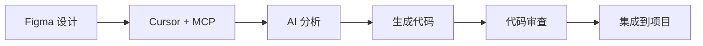

# Figma MCP (Model Context Protocol) 集成指南

## 什么是 MCP？

Model Context Protocol (MCP) 是由 Anthropic 开发的开放协议，允许 AI 助手（如 Claude）连接到外部数据源和工具。Cursor 编辑器原生支持 MCP，可以让 AI 直接访问 Figma 设计文件。

## 为什么要使用 MCP？

### 传统方式的局限

1. **需要手动复制粘贴**: 用户需要手动获取 Access Token 和节点链接
2. **安全性问题**: Token 可能被泄露或误用
3. **效率较低**: 每次转换都需要重复操作

### MCP 方式的优势

1. **直接访问**: AI 可以直接读取 Figma 设计文件
2. **更安全**: Token 由 Cursor 安全管理
3. **更智能**: AI 可以理解设计意图，生成更符合需求的代码
4. **更高效**: 一键完成整个转换流程

## 如何在 Cursor 中配置 Figma MCP

### 1. 安装 Figma MCP Server

```bash
npm install -g @modelcontextprotocol/server-figma
# 或
pnpm add -g @modelcontextprotocol/server-figma
```

### 2. 配置 Cursor MCP 设置

在 Cursor 中，打开设置并添加 MCP 配置：

```json
{
  "mcpServers": {
    "figma": {
      "command": "npx",
      "args": [
        "-y",
        "@modelcontextprotocol/server-figma"
      ],
      "env": {
        "FIGMA_ACCESS_TOKEN": "your-figma-access-token-here"
      }
    }
  }
}
```

### 3. 获取 Figma Access Token

1. 登录 Figma
2. 进入 Settings → Account → Personal access tokens
3. 创建新的 token
4. 将 token 添加到上述配置中

### 4. 重启 Cursor

配置完成后，重启 Cursor 以加载 MCP 配置。

## 使用 MCP 进行 Figma 转换

### 方式 1: 通过 AI 助手（推荐）

直接在 Cursor 中与 AI 对话：

```
请帮我将 Figma 文件 [file-id] 中的 [node-id] 转换为 React 组件
```

AI 将自动：
1. 通过 MCP 访问 Figma API
2. 获取设计数据
3. 分析布局和样式
4. 生成 React + Tailwind CSS 代码
5. 直接在编辑器中创建文件

### 方式 2: 使用本工具 + MCP

你仍然可以使用本工具的 UI 界面，但后端可以通过 MCP 来访问 Figma API：

1. 不需要手动输入 Access Token
2. MCP 会自动管理认证
3. 更安全、更便捷

## MCP 可用的 Figma 操作

### 读取操作

```typescript
// 获取文件信息
mcp.tools.figma.getFile(fileId)

// 获取节点数据
mcp.tools.figma.getNode(fileId, nodeId)

// 获取文件样式
mcp.tools.figma.getStyles(fileId)

// 获取组件
mcp.tools.figma.getComponents(fileId)
```

### 高级用例

#### 1. 批量转换组件

```
请将 Figma 文件中的所有按钮组件转换为 React 组件
```

AI 会：
1. 识别所有按钮组件
2. 批量转换
3. 创建组件库

#### 2. 设计系统提取

```
请从 Figma 设计文件中提取设计系统，生成 Tailwind 配置
```

AI 会：
1. 分析颜色、字体、间距
2. 生成 tailwind.config.js
3. 创建设计 token

#### 3. 响应式适配

```
请将这个桌面端设计转换为响应式组件，同时支持移动端
```

AI 会：
1. 分析设计尺寸
2. 添加响应式断点
3. 生成移动端适配代码

## 集成到项目工作流

### 开发流程



### 最佳实践

1. **设计规范化**: 在 Figma 中保持一致的命名和结构
2. **使用 Auto Layout**: 让 AI 能更好地理解布局意图
3. **组件化设计**: 将设计拆分为可复用的组件
4. **添加注释**: 在 Figma 中添加设计说明，AI 可以读取
5. **版本控制**: 使用 Figma 的版本功能，便于追踪变更

## 安全性考虑

### Token 管理

1. **环境变量**: 将 token 存储在环境变量中
2. **权限最小化**: 只授予必要的读取权限
3. **定期轮换**: 定期更新 Access Token
4. **团队 Token**: 使用团队级别的 token 而非个人 token

### 数据隐私

1. **本地处理**: MCP 在本地运行，不会上传数据到第三方
2. **选择性访问**: 只访问需要转换的特定节点
3. **审计日志**: 保留访问记录，便于审计

## 故障排查

### MCP 连接失败

```bash
# 检查 MCP 状态
cursor --mcp-status

# 重启 MCP 服务
cursor --mcp-restart

# 查看 MCP 日志
cursor --mcp-logs
```

### Token 无效

1. 检查 token 是否正确配置
2. 确认 token 未过期
3. 验证 token 权限

### 找不到节点

1. 确认文件 ID 和节点 ID 正确
2. 检查是否有访问权限
3. 验证节点是否存在

## 未来展望

### 计划中的功能

1. **双向同步**: 代码变更同步回 Figma
2. **实时预览**: 在 Cursor 中实时预览 Figma 设计
3. **智能提示**: AI 根据设计自动建议代码改进
4. **设计审查**: AI 自动检查设计与代码的一致性

### 社区贡献

欢迎为本项目贡献代码或提出建议：

1. Fork 项目
2. 创建特性分支
3. 提交 Pull Request

## 参考资源

### 官方文档

- [Model Context Protocol 文档](https://modelcontextprotocol.io/)
- [Figma API 文档](https://www.figma.com/developers/api)
- [Cursor 编辑器文档](https://cursor.sh/docs)

### 相关工具

- [@modelcontextprotocol/server-figma](https://github.com/modelcontextprotocol/servers/tree/main/figma)
- [Figma Plugin API](https://www.figma.com/plugin-docs/)
- [Tailwind CSS](https://tailwindcss.com/)

## 示例：完整工作流

### 场景：将 Figma 设计转换为 Next.js 页面

1. **在 Figma 中准备设计**
   - 创建完整的页面设计
   - 使用 Auto Layout
   - 规范命名（如 "Button/Primary"）

2. **在 Cursor 中使用 AI**
   ```
   请将 Figma 文件 ABC123 中的 Login 页面转换为 Next.js 页面，
   使用 Tailwind CSS，包含表单验证
   ```

3. **AI 自动完成**
   - 读取 Figma 设计
   - 生成页面组件
   - 添加表单验证逻辑
   - 创建测试文件

4. **审查和调整**
   - 检查生成的代码
   - 运行测试
   - 必要时进行微调

5. **集成到项目**
   - 提交代码
   - 部署测试环境
   - 代码审查

## 总结

通过 MCP 集成，Figma 到代码的转换变得更加智能和高效。结合 Cursor 的 AI 能力和本工具的转换功能，可以大大提升前端开发效率，让设计和开发更紧密地协作。

---

**注意**: MCP 功能需要 Cursor 编辑器的最新版本。如果遇到问题，请确保你的 Cursor 已更新到最新版本。
